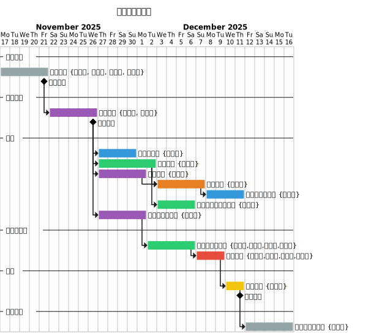
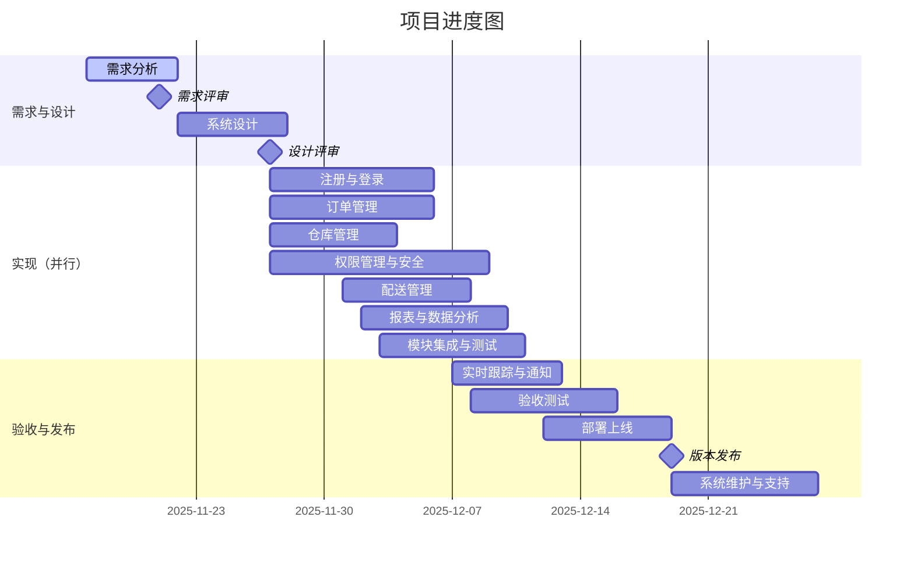

# 项目开发模型与进度

- 内容基于进度图，对文档结构与展示进行美化。

## 项目进度图

## 主要特征：瀑布模型

- 严格的阶段划分：需求分析 → 系统设计 → 实现 → 测试 → 部署 → 维护。
- 前一阶段完成后再进入下一阶段，界限清晰。
- 线性顺序执行：需求评审在需求分析完成后进行；设计在评审结束后启动；实现在设计评审后开始。
- 文档驱动：阶段末设评审点，强调交付物与确认。

## 增量开发特征

- 实现阶段采用模块并行开发：注册与登录、订单管理、仓库管理等。
- 各模块可独立开发与测试，最终统一集成。

## 选择该模型的原因

- 需求相对明确，功能边界清晰。
- 项目规模适中（约1.5个月），适合预测性计划。
- 质量要求高，需要阶段评审保证质量。
- 模块独立性强，便于并行与集成。

## 模型优势与项目匹配度

| 特征 | 项目体现 | 优势 |
| --- | --- | --- |
| 计划性强 | 详细甘特图与时间安排 | 便于进度控制 |
| 阶段明确 | 清晰阶段划分与评审点 | 降低风险 |
| 文档完整 | 各阶段交付物明确 | 便于维护 |

## 总结

- 以瀑布模型为主、结合增量开发的混合模式与项目匹配度高。
- 在保证可控性的同时，通过并行开发提升效率。
- 适用于中小型、需求明确的软件项目。